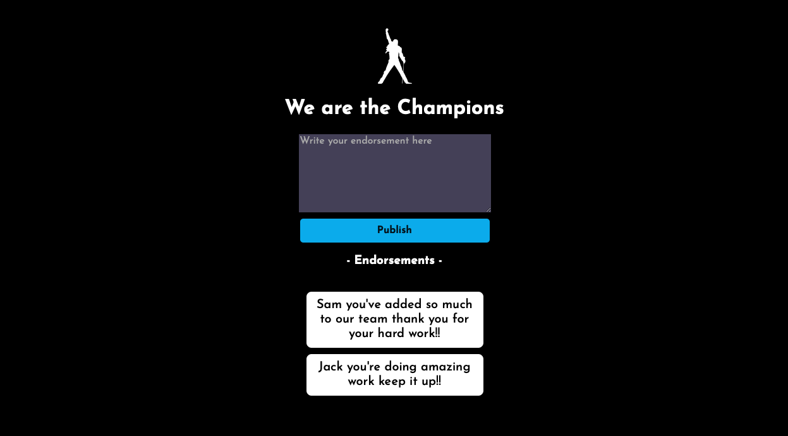

# Endorsements App
## Screenshot

## Description

+ This Endorsements App allow users to endorse other people anonymously and it will all be displayed in the endorsement list below it can be eventually removed just by clicking on it.
+ The endorsements are saved to the firebase database, which means they are visible to anyone using the app
+ After opening the app on chrome browser, click the options button (usually the 3 dot icon) and click on "Add to Home screen". The app will then be added to your screen as an app.
    + This is part of the Scrimba Front-End Career Path projects
## Built With

+ HTML
+ CSS
+ JavaScript
+ Firebase

## Live Demo

- Live Site URL: [Here](https://hudamab95.github.io/Endorsements-App/)
